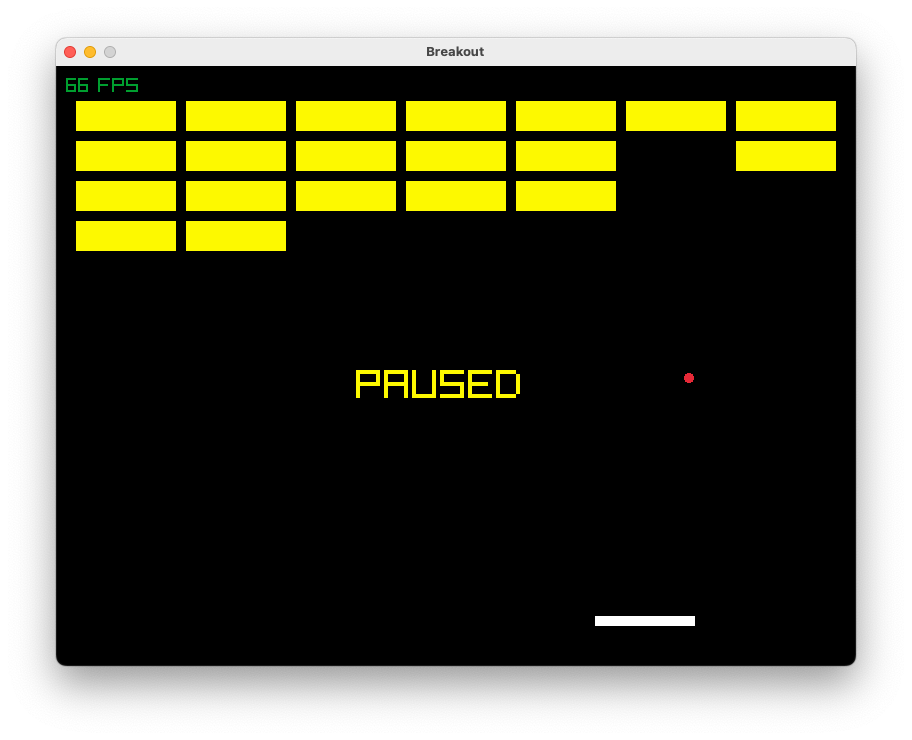
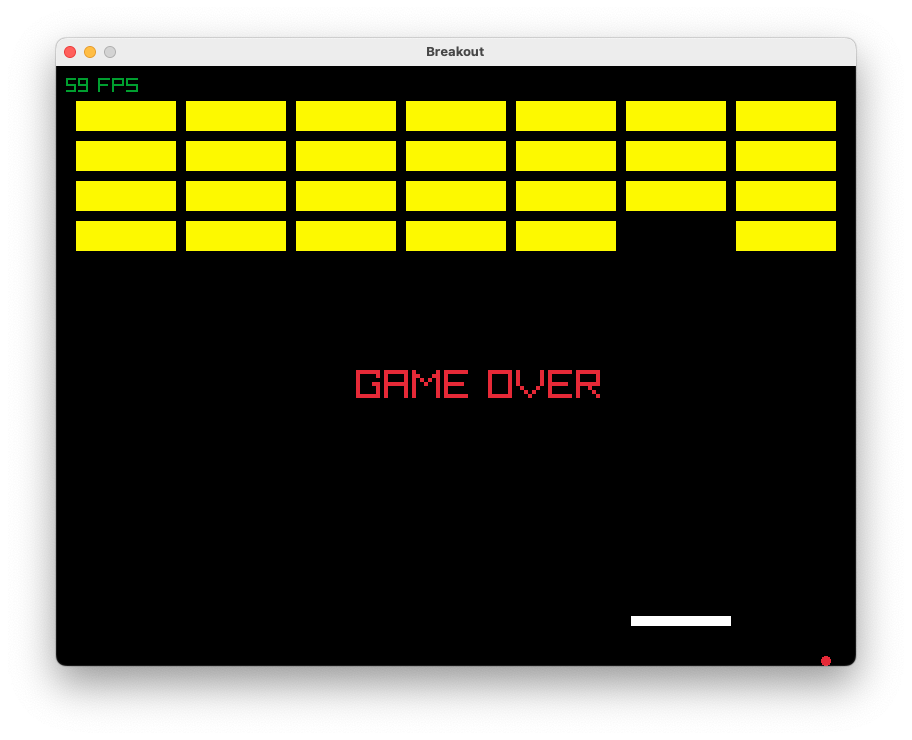

# Breakout

This is a simple Breakout game implemented in C++ using the Raylib library.

##Screenshots




## Getting Started

To run the game, you will need to have the raylib library installed on your machine. Follow the instructions on the [raylib website](https://www.raylib.com) to install the library on your system.

Once you have raylib installed, clone this repository and navigate to the root directory. Run the following commands to compile and run the game:

```bash
$ g++ main.cpp `pkg-config --libs --cflags raylib` -o main
$ ./main.out
```

## Controls

- Use the left and right arrow keys to control the paddle
- Press the 'P' key to pause the game.

## Gameplay

The objective of the game is to destroy all the bricks using a bouncing ball and a paddle. The ball bounces off the walls and the paddle. Use the left and right arrow keys to move the paddle horizontally and prevent the ball from falling off the bottom of the screen.

## Credits

This game was created by using the raylib library. The raylib library is developed by [Raylib Team](https://github.com/raysan5/raylib#development-and-contributors).